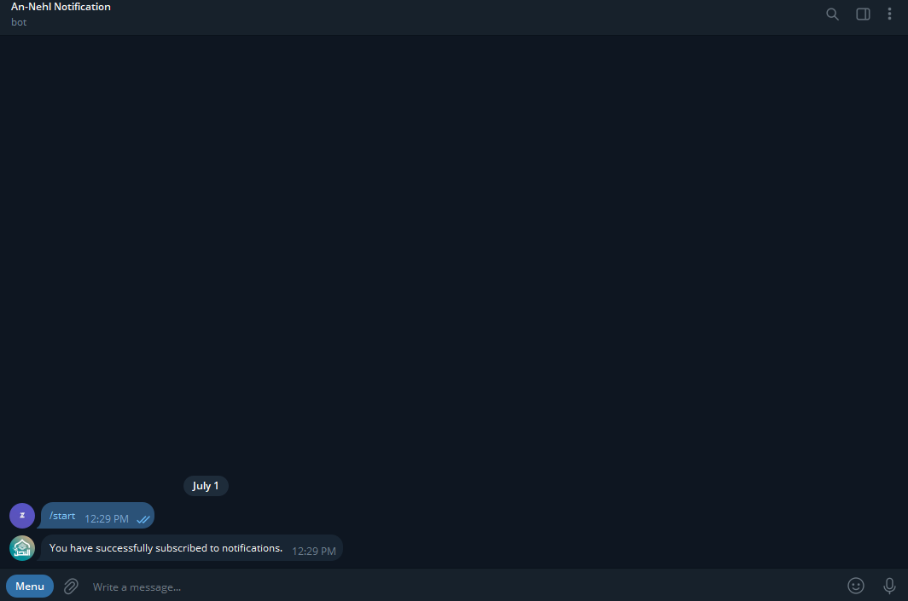
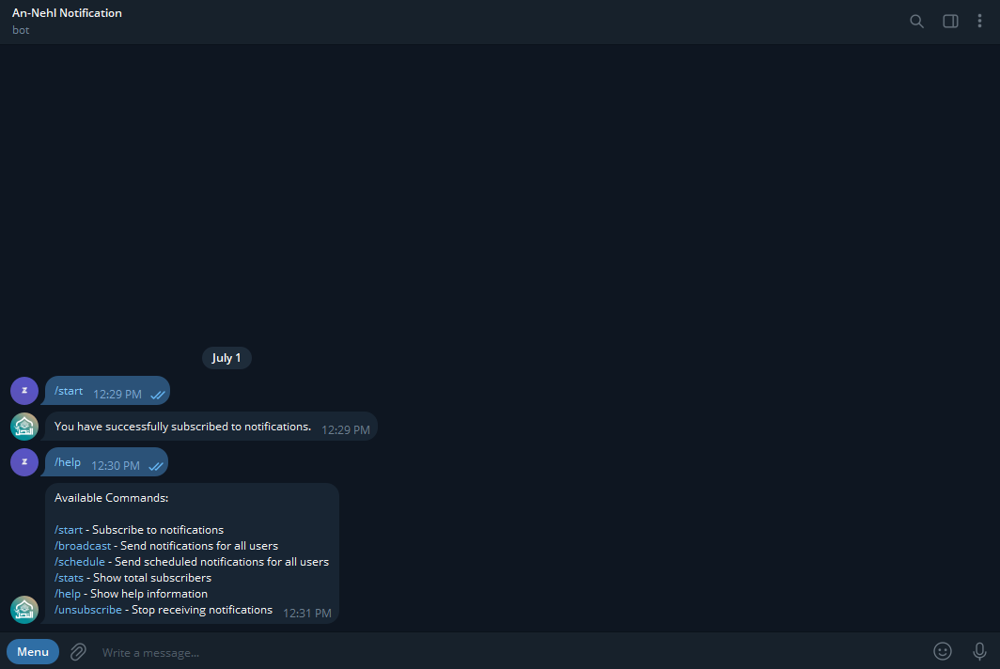
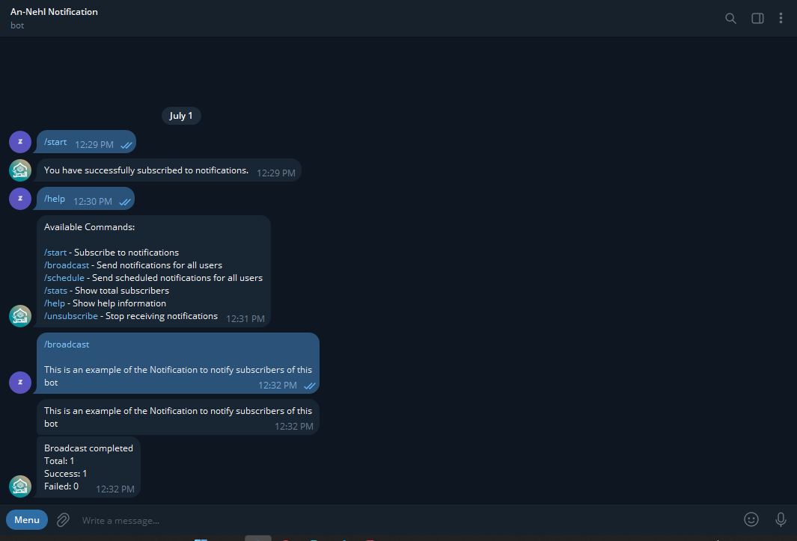

# NotifyHub Bot

NotifyHub Bot is a production-style Telegram notification bot built with Python, python-telegram-bot (PTB), and SQLite.

The project was developed using a layered architecture to separate responsibilities and improve maintainability. It demonstrates how to build a real-world Telegram bot using repositories, services, handlers, scheduling, logging, and configuration management.

---

## Features

### User Features

* Subscribe to notifications using `/start`
* Prevent duplicate subscriptions
* View available commands using `/help`
* Unsubscribe from notifications using `/unsubscribe`

### Admin Features

* Broadcast messages to all subscribers using `/broadcast`
* View subscriber statistics using `/stats`
* Schedule future broadcasts using `/schedule`

### System Features

* SQLite database storage
* Repository pattern implementation
* Service layer architecture
* Async handlers using python-telegram-bot v22+
* JobQueue-based scheduled notifications
* Environment-based configuration management
* Logging support
* Safe message delivery with error handling
* Basic rate limiting for broadcasts

---

## Project Architecture

```text
Telegram User
      │
      ▼
Handlers
      │
      ▼
Services
      │
      ▼
Repositories
      │
      ▼
SQLite Database
```

### Architecture Layers

#### Handlers

Responsible for receiving Telegram commands and interacting with services.

Examples:

* start.py
* help.py
* unsubscribe.py
* broadcast.py
* schedule.py
* stats.py

#### Services

Contain business logic.

Examples:

* SubscriberService
* NotificationService
* AdminService

#### Repositories

Responsible for database operations.

Examples:

* SubscriberRepository

#### Database

Handles database connection and schema initialization.

---

## Project Structure

```text
notifyhub-bot/
│
├── bot/
│   ├── config/
│   │   └── settings.py
│   │
│   ├── database/
│   │   ├── connection.py
│   │   └── schema.py
│   │
│   ├── repositories/
│   │   └── subscriber_repository.py
│   │
│   ├── services/
│   │   ├── admin_service.py
│   │   ├── notification_service.py
│   │   └── subscriber_service.py
│   │
│   ├── handlers/
│   │   ├── start.py
│   │   ├── help.py
│   │   ├── unsubscribe.py
│   │   ├── stats.py
│   │   ├── broadcast.py
│   │   ├── schedule.py
│   │   └── register.py
│   │
│   ├── jobs/
│   │   └── scheduled_broadcast.py
│   │
│   └── utils/
│       ├── logger.py
│       └── telegram_safe.py
│
├── logs/
├── .env
├── requirements.txt
├── main.py
└── README.md
```

---

## Installation

### 1. Clone the Repository

```bash
git clone https://github.com/kalid-26/notifybot.git
cd notifybot
```

### 2. Create Virtual Environment

```bash
python -m venv .venv
```

Activate the environment:

Windows:

```bash
cd venv\Scripts\activate
```

Linux / macOS:

```bash
source venv/bin/activate
```

### 3. Install Dependencies

```bash
pip install -r requirements.txt
```

---

## Environment Variables

Create a `.env` file in the project root.

```env
BOT_TOKEN=your_telegram_bot_token
ADMIN_IDS=get_id_from_first_user
```

Multiple admin IDs can be provided:

```env
ADMIN_IDS=id_1, id_2, id_3
```

---

## Running the Bot

```bash
python main.py
```

---

## Available Commands

### User Commands

| Command        | Description                    |
| -------------- | ------------------------------ |
| `/start`       | Subscribe to get notifications     |
| `/help`        | Display help information(availbale commands)       |
| `/unsubscribe` | Unsubscribe from notifications |

### Admin Commands

| Command                         | Description                       |
| ------------------------------- | --------------------------------- |
| `/stats`                        | View total subscriber count       |
| `/broadcast <message>`          | Send a message to all subscribers |
| `/schedule <seconds> <message>` | Schedule a future broadcast       |

---

## Example Usage

### Broadcast Message

```text
/broadcast Hello Subscribers!
```

### Schedule Notification

```text
/schedule 60 System maintenance starts in one hour.
```

This schedules a broadcast to be sent after 60 seconds.

---

## Screenshots

* start command


* help command


* broadcast command


## Technologies Used

* Python 3
* python-telegram-bot (PTB v22.8)
* SQLite3
* APScheduler (via PTB JobQueue)
* python-decouple
* Logging Module

---

## Learning Objectives

This project was built to practice:

* Telegram Bot Development
* Clean Architecture
* Repository Pattern
* Service Layer Pattern
* SQLite Integration
* Async Programming
* Job Scheduling
* Configuration Management
* Logging and Error Handling
* Modular Project Structure

---

## Future Improvements

Potential v2.0 features:

* PostgreSQL support
* Docker deployment
* Webhook support
* Scheduled jobs persistence
* Media broadcasts (images, documents)
* Admin dashboard
* User management panel
* Automated testing

---

## License

This project is intended for educational and portfolio purposes.

Developed by [Kalid Mohammed](https://kalid.zemzemlabs.com/)